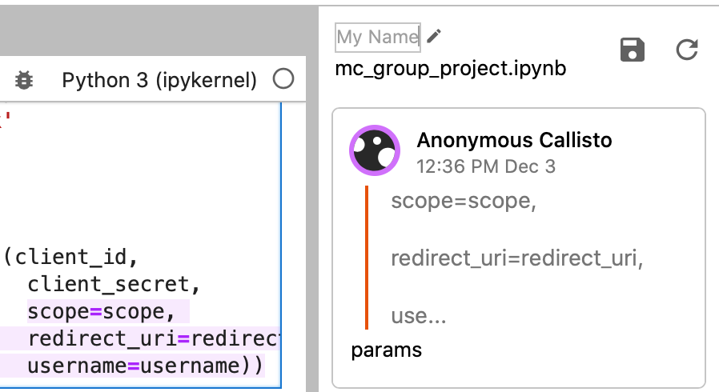
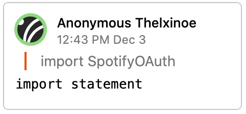
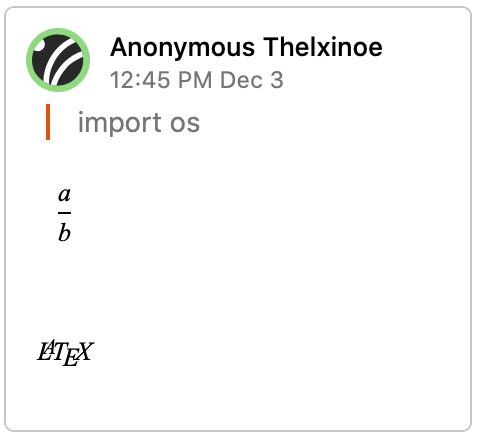

Features
=========

User Icon and Color
---------------------

Each user on a session has a unique ``identity`` which is designated by the profile picture and color associated with their comments.

.. image:: ../images/init_comment.png
    :width: 500

A user's name initalizes to ``Anonymous {Jupiter Moon Name}`` but can be altered by clicking on the pencil icon when hovering over your name. User color will be reflected in highlights when making text selection comments.

Save and Refresh
------------------

Comment panels have a built-in auto save feature, however, this happens periodically. To save your comment, press the save icon in the top, and click on the refresh icon to see your changes reflected.

Markdown and LaTeX
---------------------

Comments also support Markdown and LaTeX syntax.

