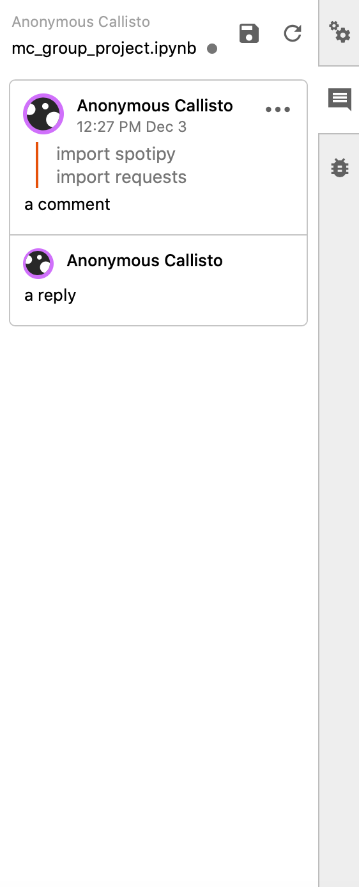

Users
=======

**A User's introduction to JupyterLab Comments**

Layout
~~~~~~~~~

Comments can be accessed by clicking on the comment icon on the right panel. Doing so will open up the main ``Comment Panel``.

Use Cases and Features
~~~~~~~~~~~~~~~~~~~~~~~~

.. toctree::
    usage.md
    features.rst
    :maxdepth: 1
